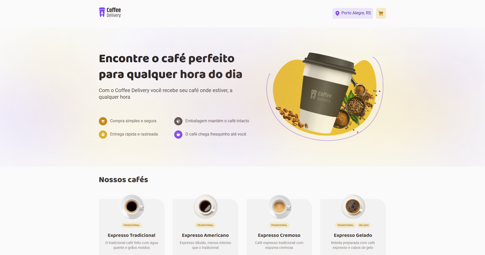

<h1 align="center">
    
</h1>
<p align="center">Coffee Delivery. Um aplicativo onde você pode fazer pedidos, adicionar itens ao carrinho, e finalizar a compra após inserir o endereço e a forma de pagamento.</p>
<p align="center">
 <a href="#sobre-o-projeto">Sobre o Projeto</a> |
 <a href="#tecnologias">Tecnologias</a> |
 <a href="#iniciando-o-projeto">Iniciando o projeto</a> |
 <a href="#licença">Licença</a> |
 <a href="#autor">Autor</a> 
</p>

### Sobre o Projeto

Coffee Delivery é um aplicativo projetado para facilitar a compra de café e outros itens relacionados. Os usuários podem fazer pedidos, adicionar itens ao carrinho, e finalizar a compra após fornecer o endereço e escolher a forma de pagamento.

- [x] Fazer pedidos de café e outros itens
- [x] Adicionar itens ao carrinho
- [x] Finalizar a compra
- [x] Inserir endereço para entrega
- [x] Escolher forma de pagamento

---

### Tecnologias

- [React](https://reactjs.org/) - Biblioteca JavaScript para construir interfaces de usuário
- [React Router DOM](https://reactrouter.com/) - Biblioteca para roteamento em aplicativos React
- [React Hook Form](https://react-hook-form.com/) - Biblioteca para gerenciamento de formulários
- [Styled Components](https://styled-components.com/) - Biblioteca para estilização de componentes React
- [Zod](https://zod.dev/) - Biblioteca para validação de esquemas e dados
- [Immer](https://immerjs.github.io/immer/) - Biblioteca para manipulação imutável de estados
- [Phosphor Icons](https://phosphoricons.com/) - Biblioteca de ícones

---

### Como Começar

```bash
# Clone o aplicativo
$ git clone https://github.com/sillasemanoel/coffee-delivery

# Navegue até o diretório do aplicativo
$ cd coffee-delivery

# Instale as dependências
$ npm i

# Para iniciar o aplicativo
$ npm run dev
```

---

### Licença

Distribuído sob a Licença MIT. Veja [LICENSE](LICENSE) para mais informações.

---

### Autor

Feito por Sillas Emanoel 👋🏽
